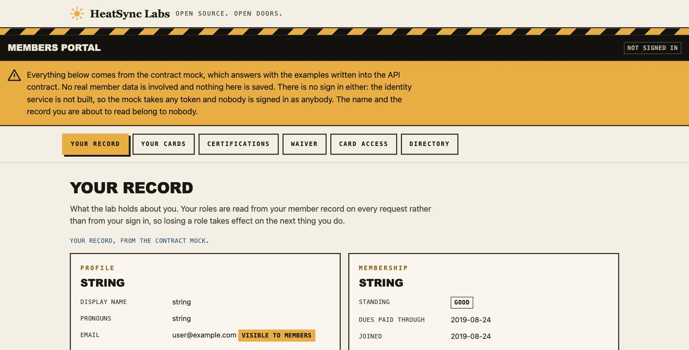
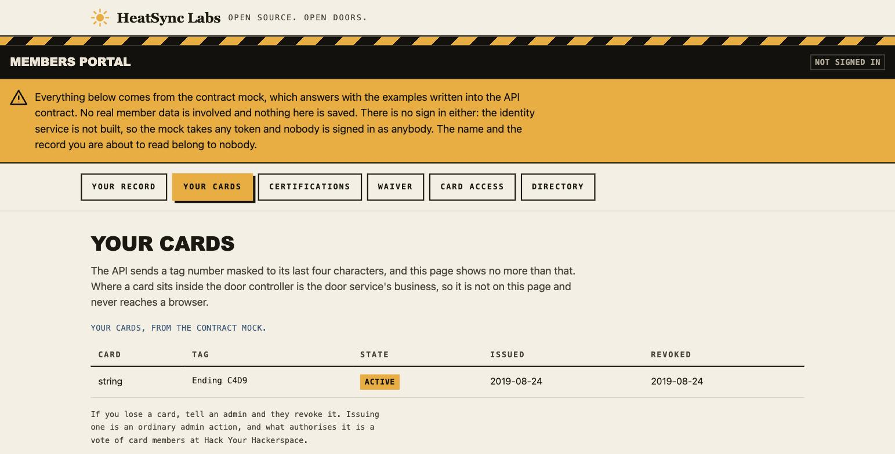

# Project ORO

Members and door access for [HeatSync Labs](https://www.heatsynclabs.org), a
community workshop in Mesa, Arizona.

It replaces the Rails 3.2.8 app at `members.heatsynclabs.org` and the software
around the Arduino that unlocks the building. The Arduino itself stays.

**Nothing is deployed. Nothing in production has been touched.** You can run the
whole thing on a laptop today, with invented data.





Those are real screenshots of `make development` on a laptop. The amber band is
there because the portal is reading a mock of the API contract, not a database.
The API service exists as a first slice, and the portal does not read it yet: wiring the two together needs a sign in, which is the rest of phase 3.

---

## Run it locally

You need **Docker** (with the Compose plugin) and **python3**. Nothing else.
There is no package manager, no lockfile, no build step and nothing to install.

```sh
git clone https://github.com/heatsynclabs/project-oro.git
cd project-oro
cp .env.example .env          # then fill in every empty value, see Environment below
make development
```

Open `http://localhost:8080`. That is the members portal.

The identity service is on `http://localhost:8180`. Register the apps against it
once:

```sh
ORO_IDENTITY_URL=http://localhost:8180 python3 tools/identity/configure.py \
  --members-origin http://localhost:8080 \
  --admin-origin   http://localhost:8081 \
  --door-origin    http://localhost:8082
```

Stop it with `make down`. The database volume is kept.

### Make the first three admins

The database ships with no members. It also enforces that granting admin needs a
second admin to approve it, which cannot bind until admins exist. So three admin
grants are allowed to carry no approval, once. This is the command that spends
them:

```sh
make bootstrap-admins \
  ADMIN1="Ada Byron <ada@example.org>" \
  ADMIN2="Grace Hopper <grace@example.org>" \
  ADMIN3="Katherine Johnson <katherine@example.org>"
```

Run it from a terminal. Each person gets an account, a member record and the
admin role. Their first sign in password is printed on that terminal and written
to no file, so redirecting the output to keep the report does not capture a
password. They are made to choose their own password the first time they sign
in.

Run it twice and it reports what is already there and changes nothing. Ask for a
fourth admin and the database refuses, which is the point. After the third, the
two approver rule arms itself and stays armed. Revoking admins does not open it
again.

`tools/bootstrap/README.md` has the detail.

### With or without the old database

Both work, and neither needs the other.

**Without.** Everything above is the whole of it. The stack starts empty and you
add people with `make bootstrap-admins`. Nothing reads or contacts the existing
system.

**With.** If you have a dump of the legacy members database, the import carries
members, cards, the `admin` and `accountant` flags as roles, and the waiver date
as a pointer to where the document is kept. It refuses to start while anything in
the data still needs a person to decide, and it names the rows.

```sh
make migration-test     # proves the import against an invented fixture
```

Read `tools/migration/README.md` before running it against anything real. Every
card keeps the slot it had, because a slot is an EEPROM address on the door
controller and renumbering one points a member at somebody else's door
permission.

---

## Local against production

One override file is the whole difference.

| | Your laptop (`make development`) | A deployment (`make up`) |
|---|---|---|
| Command | `docker compose -f compose.yaml -f compose.development.yaml up` | `docker compose up` |
| Scheme | plain HTTP, nothing redirects | HTTPS, and plain HTTP redirects to it |
| Certificate | none, so nothing to click through | from `ORO_TLS`, either Caddy's local authority or Let's Encrypt |
| The root serves | the members portal | a 404 saying no application is deployed here yet |
| `/v1/*` | the contract mock | nothing yet. `services/api` is built but not wired into either shape |
| Identity service | `localhost:8180`, loopback only | `id.YOURHOST`, through Caddy |
| The mock | running | absent. It never reaches a deployment |

A laptop serves plain HTTP on purpose. Under a local certificate authority Chrome
shows an interstitial that no automation can click through, and a volunteer gets
past it only by installing a root certificate as an administrator.
`docs/decisions/0003-plain-http-for-development.md` records what that trades
away: a `Secure` cookie is never sent on a plain HTTP origin, and mixed content
cannot happen where nothing is HTTPS. Check that kind of change against `make up`
before it ships.

A deployment also needs DNS. `YOURHOST` and `id.YOURHOST` both have to resolve to
the machine, and for a public certificate they have to resolve from the internet
before Caddy can get one.

---

## Environment

Copy `.env.example` to `.env`. It documents every line. Nothing a deployment
needs has a default, and the stack refuses to start rather than run on a value
nobody chose.

| Variable | What it is | Generate it with |
|---|---|---|
| `ORO_HOSTNAME` | the name Caddy serves. `localhost` on a laptop | |
| `ORO_TLS` | `internal` for a local authority, or an email address for a public certificate | |
| `ORO_HTTP_PORT`, `ORO_HTTPS_PORT` | ports Caddy binds. `80` and `443` on a deployment | |
| `ORO_DB_PASSWORD` | the Postgres superuser password | `openssl rand -base64 24` |
| `ORO_IDENTITY_DB_PASSWORD` | the identity service's own database login | `openssl rand -base64 24` |
| `ORO_IDENTITY_MASTERKEY` | exactly 32 bytes. Encrypts every secret the identity service stores | `openssl rand -hex 16` |
| `ORO_IDENTITY_ADMIN_USERNAME`, `ORO_IDENTITY_ADMIN_PASSWORD` | the first administrator of the identity service | |
| `ORO_IDENTITY_PORT` | the port a laptop publishes the identity service on. Defaults to 8180 | |

Back up `ORO_IDENTITY_MASTERKEY` somewhere other than beside the database dump.
Lose it and the identity database cannot be read.

---

## Roadmap

Seven phases. **None of them has met its exit criterion yet**, and a phase does
not start while the roles it needs have no names against them.
`docs/plan/order-of-operations.md` has the exit criterion for each.

**Phase 0, foundations.** Blocked on getting a shell on the current server.

- [x] Repository, working rules, prose gate, commit hook, CI running all of it
- [x] Compose stack, Makefile, documented environment
- [x] A backup command, and a restore drill that proves the mechanism
- [ ] That backup running on a timer, with an offsite copy and the drill
      posting a result somewhere a named person reads
- [ ] DNS for `id`, `api`, `admin`, `door`
- [ ] A verified restore of production onto a staging copy

**Phase 1, the contract and the door port.** Blocked on a review.

- [x] The members API written as OpenAPI, with a mock that serves it
- [x] The database: schema, constraints, comments, row level security
- [x] A test per policy per role, including anonymous, and a refusal test per rule
- [x] The door controller port, a fake that speaks the real wire protocol, and a
      conformance suite both must pass
- [x] The GANTRY token layer, with a contrast checker over every ink on every ground
- [ ] The contract reviewed by somebody who did not write it

**Phase 2, identity.** Blocked on volunteers.

- [x] The identity service in the stack, with its own database
- [x] Four clients registered, ten minute tokens, rotating refresh, lab branding
- [x] Proof that it holds the passwords members already have, using hashes the
      old application wrote
- [ ] Ten real members signing in to staging with the password they already use

**Phase 3, member management.**

- [x] The members portal, read only, against the contract mock
- [x] The legacy import: members, cards, roles and waivers, with every card at
      the slot it had
- [x] `services/api`, first slice: your own record and the directory, with the
      database policies deciding every answer. Built ahead of the order and not
      yet wired into the stack, so the portal still reads the mock
- [ ] Certifications, payments and door events carried across

**Phase 4, admin.** Blocked on a vote at Hack Your Hackerspace.

- [x] The two approver rule, enforced in the database and tested there
- [ ] The admin portal
- [ ] Card issue and revoke, with a reason required on revoke

**Phase 5, the door.**

- [x] The adapter port and its fake, with the conformance suite, built early on purpose
- [ ] The door service and its reconcile loop, plus the real adapter
- [ ] A week running read only beside the live system, then writes

**Phase 6, cutover.**

- [ ] Point the members hostname at the new portal
- [ ] Run the old app read only for two weeks, then decommission it

Through all of it: **physical cards keep opening the door, even when everything
in this repository is down.** The old app keeps driving the door until phase 5
says otherwise.

---

## Everything you can run

```sh
make check              # every suite below, in one command
make help               # every target, with a line each
```

| Command | What it proves | Touches your stack? |
|---|---|---|
| `make test` | the schema from nothing, and every policy and rule | no, throwaway container |
| `make mock-test` | the mock serves the API contract | no, own project |
| `make development-test` | both stack shapes, laptop and deployment | no, own project |
| `make portal-test` | the members portal through Caddy | no, own project |
| `make identity-test` | the identity service holds the lab's existing passwords | no, own project |
| `make migration-test` | the legacy import, and every refusal it makes | no, own project |
| `make backup-test` | the restore drill: back up, destroy the database, restore, check every row came back | no, own project |
| `./tools/bootstrap/tests/run.sh` | the first three admins seated, and the fourth refused | no, own project |
| `make ceilings` | file and function size limits | no |
| `make import-boundaries` | the layers only import downward, over the Python in `services/` | no |
| `make api-test` | the first three operations of the members API, against a real Postgres and the real policies | no, own project |
| `./tools/ci/voice-gate.sh` | the writing rules, over every tracked file | no |
| `./services/door/tests/run.sh` | the door port, its fake, and the conformance suite | no, python only |
| `./packages/gantry-tokens/tests/run.sh` | the theme, every ink on every ground | no, python only |
| `make up` / `make down` / `make ps` / `make psql` / `make logs` | operating the stack | **yes** |
| `make development` | starts the laptop stack and leaves it running | **yes** |
| `make bootstrap-admins` | seats the first three admins | **yes** |
| `make backup` | writes a backup outside this repository | **yes**, reads it |
| `make restore FILE=...` | restores one. Refuses over a database that holds members unless you name how many you are destroying | **yes** |

Every suite builds and removes its own containers and leaves nothing behind. Each
one prints its own counts, so run it rather than trusting a number written down
somewhere.

Enable the commit hook once per clone:

```sh
git config core.hooksPath .githooks
```

---

## Where things are

```
CLAUDE.md            the working rules. Most have a gate that enforces them
HANDOFF.md           current state, how to run things, and the traps
docs/plan/           architecture, API design, data model, build order, people
docs/decisions/      one short record per decision, and what would reverse it
docs/glossary.md     domain words. The code uses these exactly

db/migrations/       the schema. This is the authority
db/tests/            the policy and rule suite

services/door/       the controller port, the fake, the conformance suite
packages/gantry-tokens/  the theme, and the contrast validator
apps/members/        the members portal

tools/bootstrap/     seat the first three admins
tools/migration/     the legacy import, and a fixture the old app itself wrote
tools/identity/      the password proof
tools/voice-check/   the writing gate

compose.yaml         a deployment
compose.development.yaml   what a laptop adds on top
```

If you read two files, read `CLAUDE.md` and
`docs/plan/people-and-custody.md`. The second one holds the real blocker, which
is that every role in this project is still unnamed.

---

## Contributing

Open to members and to anyone else who wants to help.

Read `CLAUDE.md` first. It is short, and most of it is enforced rather than
advisory. Two rules catch people out:

- No LLM is named as an author, co-author or reviewer, anywhere. The commit hook
  rejects it and so does CI.
- No em dashes and no emoji. Swapping in a double hyphen is caught too. The
  prose gate rejects all of it.

Tests come with the change. Database rules are tested at the database level,
because that is where they are enforced. Decisions go in `docs/decisions/` as
short records; reversing one is fine, reversing one without writing down what
changed is not.

---

## Licence

**Not decided, and this needs fixing.** A public repository with no licence is
all rights reserved by default, which is not the intent. MIT matches the rest of
the organisation. It needs a board decision, and it is tracked in
`ATTRIBUTIONS.md` alongside the same gap in two other HeatSync repositories.

---

## Built on other people's work

Prior HeatSync work, without which this would be guesswork:

- **[Open-Source-Access-Control-Web-Interface](https://github.com/heatsynclabs/Open-Source-Access-Control-Web-Interface)**,
  the members app that has run the lab since around 2010. Its schema, its
  `space_api.json` contract and its authorization matrix are the starting point.
- **[Open_Access_Control_Ethernet](https://github.com/heatsynclabs/Open_Access_Control_Ethernet)**,
  the door firmware, live since 2013. The wire protocol and the EEPROM slot model
  come from reading it. Forked from
  [zyphlar/Open_Access_Control_Ethernet](https://github.com/zyphlar/Open_Access_Control_Ethernet).
- **[members_api](https://github.com/heatsynclabs/members_api)** and members_ui
  (Apache 2.0), the 2018 rewrite, which is the direct ancestor of this schema.
- **[hsl-members-site](https://github.com/heatsynclabs/hsl-members-site)**, the
  2025 rewrite, which produced the best annotated schema of the three.
- **[hackerspace-management](https://github.com/virgilvox/hackerspace-management)**,
  the only one to model certification expiry and revocation. Adopted.
- **[new-hsl](https://github.com/heatsynclabs/new-hsl)**, the public site, and the
  GANTRY design tokens this theme extends.
- **[hsl_door_api_poller](https://github.com/mindblender/hsl_door_api_poller)**,
  which reads `space_api.json` with a 1 KB buffer, which is why that payload has
  a hard size ceiling.

Ideas taken from outside the lab: [SpaceAPI](https://spaceapi.io) for
`space_api.json`; [PostgREST](https://postgrest.org), rejected as the front door
but its central idea that authorization belongs in the database is the best part
of this design; [Supabase](https://supabase.com) for the overall shape;
hexagonal architecture for the door port and adapter;
[pg_regress](https://www.postgresql.org/docs/current/regress.html) for how the
database tests are written; architecture decision records for `docs/decisions/`;
and [RFC 9457](https://www.rfc-editor.org/rfc/rfc9457) for the error shape.

Full licence details are in `ATTRIBUTIONS.md`.

---

## Thanks

To everyone who built and kept running the systems this replaces. The door has
worked for over a decade and the members app has outlived two attempts to retire
it, which is a better record than either usually gets credit for.

To the three previous rewrites. They all stalled, and they still did the most
useful thing available: three people, working separately, in three languages,
independently arrived at nearly the same data model. That agreement is the
strongest evidence this project had.

To the members who wrote down what they actually needed, in meetings and on the
mailing list, sometimes years ago. Most of the requirements in `docs/plan/` are
not new. Somebody who had felt the problem had already stated them.
